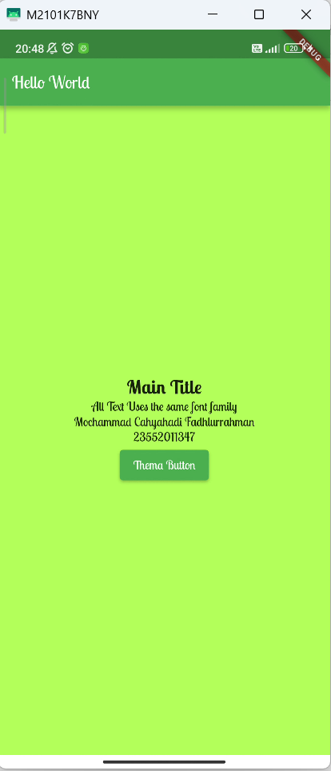

# Flutter ThemaApps Demo 

Aplikasi Flutter sederhana untuk mendemonstrasikan penggunaan custom font,sytle color background.

## 
- **Nama**: [Mochammad Cahyahadi Fadhlurrahman]
- **NIM**: [23552011347]


## Screenshot


## Cara Menjalankan
1. Clone repository ini
2. Jalankan `flutter pub get`
3. Jalankan `flutter run`

## Struktur Project
```
project/
├── lib/
│   └── main.dart
├── assets/
│   └── fonts/
│       ├── LobsterTwo-Bold.ttf
│       ├── LobsterTwo-BoldItalic.ttf
│       ├── LobsterTwo-Regular.ttf
│       └── LobsterTwo-Italic.ttf
├── pubspec.yaml
└── README.md
```
